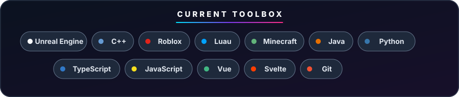

  

  

  
  
  

## Hey, I'm Eli

I'm a developer and creator who likes turning curiosity into something playable, useful, or worth sharing. My work moves between **game development**, **creator tools**, **web projects**, and the occasional experiment that teaches me a new system.

- 🎮 Building gameplay systems and tools with **Unreal Engine**, **Roblox/Luau**, and **Minecraft/Java**
- 🎥 Sharing the process on [**Learning the Wires**](https://www.youtube.com/@learningthewires)
- 🛠️ Creating my own video workflow tools for clipping, downloading, audio separation, and editing
- 💻 Making personal apps, automations, utilities, and web experiences
- 🌐 Collecting my work at [**elidolney.dev**](https://elidolney.dev/)

## What I'm building

<strong>🎮 Games, worlds & gameplay systems</strong>

 

I enjoy the part of game development where an idea becomes a mechanic: movement, interactions, world tools, mods, and reusable systems. Right now that work spans Unreal Engine/C++, Roblox/Luau, and Minecraft/Java.

- [**CraftIsLove**](https://github.com/Eli-Dolney/CraftIsLove) — C++ game-development project
- [**GrappleGun**](https://github.com/Eli-Dolney/GrappleGun) — Lua grapple-gun prototype
- [**LTW Terraformer Tool**](https://github.com/Eli-Dolney/LTW_TerraformerTool) — Java world-tool experiment
- **Structure Copy & Paste Tool** — planned Minecraft/Java builder with a 3D selection box for copying and pasting builds, plus a UI library for reusable trees, paths, and house variants

<strong>🎥 Learning the Wires & creator tools</strong>

 

[Learning the Wires](https://www.youtube.com/@learningthewires) is where I share what I'm learning, building, and testing. I also build the tools behind the videos so the creative workflow can be faster and more flexible.

- [**LTW EzEdit**](https://github.com/Eli-Dolney/LTW_EzEdit) — TypeScript editing-tool project
- [**LTW Clipper**](https://github.com/Eli-Dolney/LTW_Clipper) — creates video clips at different intervals
- [**LTW Audio Splitter**](https://github.com/Eli-Dolney/LTW_Audio_Spiltter) — separates vocals, beats, drums, and other audio layers
- [**LTW Downloader**](https://github.com/Eli-Dolney/LTW_Downloader) — Python download utility

<strong>🧪 Personal code lab</strong>

 

My repositories are also a workshop for web apps, automation, games, home tools, and small ideas. Some are polished projects; others are snapshots of a problem I wanted to solve or a technology I wanted to understand.

- [**elidolney.dev source**](https://github.com/Eli-Dolney/eli) — my Vue-powered personal site
- [**AtlasBoard**](https://github.com/Eli-Dolney/AtlasBoard) — TypeScript project
- [**HomeBot**](https://github.com/Eli-Dolney/HomeBot) — Python home-tool experiment
- [**Keyboard Kombat**](https://github.com/Eli-Dolney/keyboardkombat) — JavaScript typing game

## Toolbox

  

## Contribution arcade

  <picture>
    <source media="(prefers-color-scheme: dark)" srcset="https://raw.githubusercontent.com/Eli-Dolney/Eli-Dolney/output/github-contribution-grid-snake-dark.svg" />
    <source media="(prefers-color-scheme: light)" srcset="https://raw.githubusercontent.com/Eli-Dolney/Eli-Dolney/output/github-contribution-grid-snake.svg" />
    
  </picture>

  <a href="https://elidolney.dev/">Portfolio</a> •
  <a href="https://www.youtube.com/@learningthewires">YouTube</a> •
  <a href="https://github.com/Eli-Dolney?tab=repositories">All projects</a>

<em>Build it. Break it. Learn how the wires connect.</em>

